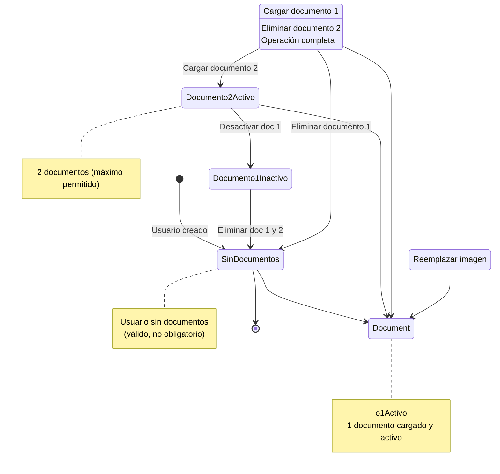
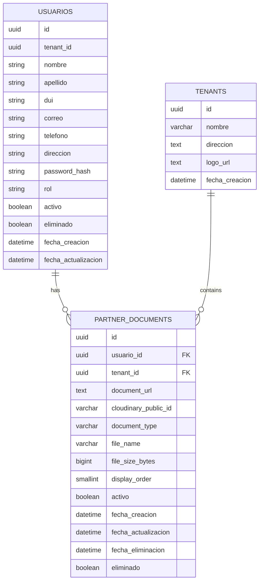
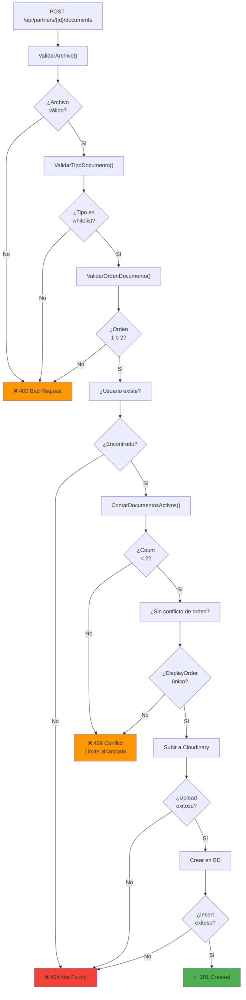
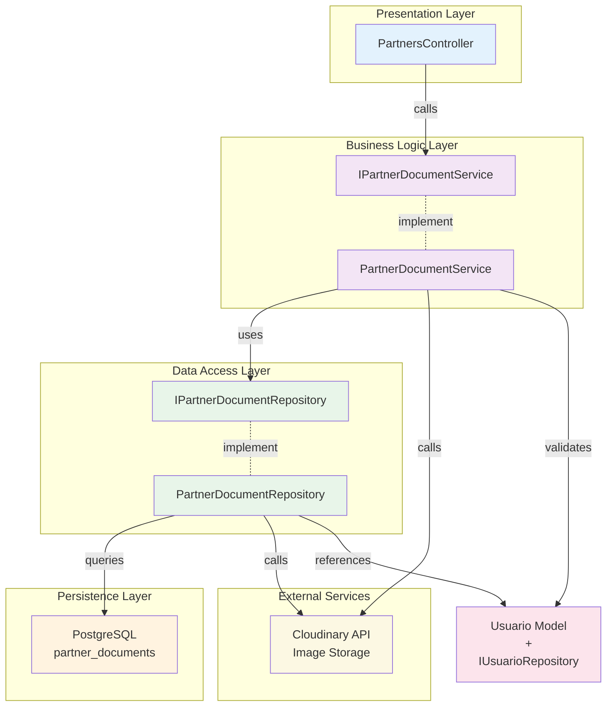

# Diagrama de Flujo - Módulo de Documentos de Partners

```mermaid
sequenceDiagram
    autonumber
    
    participant Cliente as 🖥️ Cliente<br/>(Frontend)
    participant API as 🔌 PartnersController<br/>(API)
    participant Servicio as 💼 PartnerDocumentService<br/>(Business Logic)
    participant Repo as 🗄️ PartnerDocumentRepository<br/>(Data Access)
    participant BD as 📊 PostgreSQL<br/>partner_documents
    participant Cloud as ☁️ Cloudinary<br/>(Image Storage)

    Note over Cliente,Cloud: FLUJO 1: OBTENER DOCUMENTOS DE UN USUARIO
    
    Cliente->>API: GET /api/partners/{partnerId}/documents
    API->>API: Validar JWT Token
    API->>API: Validar autorización (propietario/admin)
    API->>Servicio: ObtenerDocumentosUsuarioAsync(usuarioId, tenantId)
    
    Servicio->>Repo: ObtenerPorUsuarioIdAsync(usuarioId)
    Repo->>BD: SELECT * FROM partner_documents<br/>WHERE usuario_id=@id AND eliminado=FALSE
    BD-->>Repo: [PartnerDocument[]]
    Repo-->>Servicio: [PartnerDocument[]]
    
    Servicio->>Servicio: Mapear a PartnerDocumentDto[]
    Servicio-->>API: PartnerDocumentsListDto
    
    API-->>Cliente: 200 OK - PartnerDocumentsListDto

    Note over Cliente,Cloud: FLUJO 2: CARGAR NUEVO DOCUMENTO
    
    Cliente->>API: POST /api/partners/{partnerId}/documents<br/>(multipart/form-data)
    API->>API: ValidarRequest() - Content-Type multipart
    API->>Servicio: CargarDocumentoAsync(partnerId, file, tipo, orden)
    
    Servicio->>Servicio: ValidarArchivo()
    alt Validación de archivo falla
        Servicio-->>API: ArgumentException
        API-->>Cliente: 400 Bad Request
    end
    
    Servicio->>Servicio: ValidarTipoDocumento()
    Servicio->>Servicio: ValidarOrdenDocumento()
    
    Servicio->>Repo: ObtenerPorIdAsync(usuarioId)
    Repo->>BD: SELECT * FROM usuarios WHERE id=@id
    BD-->>Repo: Usuario?
    Repo-->>Servicio: Usuario?
    
    alt Usuario no existe
        Servicio-->>API: InvalidOperationException
        API-->>Cliente: 404 Not Found
    end
    
    Servicio->>Repo: ContarDocumentosActivosAsync(usuarioId)
    Repo->>BD: SELECT COUNT(*) FROM partner_documents<br/>WHERE usuario_id=@id AND activo=TRUE
    BD-->>Repo: int
    Repo-->>Servicio: int
    
    alt Límite de 2 documentos alcanzado
        Servicio-->>API: InvalidOperationException<br/>("máximo 2 documentos")
        API-->>Cliente: 409 Conflict
    end
    
    Servicio->>Cloud: UploadAsync(ImageUploadParams)
    alt Upload a Cloudinary falla
        Cloud-->>Servicio: ImageUploadResult with Error
        Servicio-->>API: InvalidOperationException
        API-->>Cliente: 500 Internal Server Error
    end
    
    Cloud-->>Servicio: ImageUploadResult<br/>(SecureUrl, PublicId)
    
    Servicio->>Servicio: Crear PartnerDocument object
    Servicio->>Repo: CrearAsync(documento)
    
    Repo->>BD: INSERT INTO partner_documents<br/>VALUES (...)
    BD-->>Repo: void
    Repo-->>Servicio: PartnerDocument
    
    Servicio-->>API: PartnerDocumentUploadResponseDto
    API-->>Cliente: 201 Created<br/>Location: /api/partners/documents/{id}

    Note over Cliente,Cloud: FLUJO 3: REEMPLAZAR DOCUMENTO
    
    Cliente->>API: PUT /api/partners/documents/{docId}/replace<br/>(multipart/form-data)
    API->>Servicio: ReemplazarDocumentoAsync(docId, archivo)
    
    Servicio->>Servicio: ValidarArchivo()
    Servicio->>Repo: ObtenerPorIdAsync(docId)
    Repo->>BD: SELECT * WHERE id=@id
    BD-->>Repo: PartnerDocument?
    Repo-->>Servicio: PartnerDocument?
    
    alt Documento no existe
        Servicio-->>API: InvalidOperationException
        API-->>Cliente: 404 Not Found
    end
    
    Servicio->>Cloud: DestroyAsync(CloudinaryPublicId)
    Note over Servicio,Cloud: ⚠️ No bloquea si falla <br/>(log pero continuar)
    
    Servicio->>Cloud: UploadAsync(nuevo archivo)
    Cloud-->>Servicio: ImageUploadResult
    
    Servicio->>Repo: ActualizarAsync(documento actualizado)
    Repo->>BD: UPDATE partner_documents<br/>SET document_url, cloudinary_public_id<br/>WHERE id=@id
    BD-->>Repo: bool
    Repo-->>Servicio: bool
    
    Servicio-->>API: PartnerDocumentUploadResponseDto
    API-->>Cliente: 200 OK

    Note over Cliente,Cloud: FLUJO 4: ACTUALIZAR METADATOS
    
    Cliente->>API: PATCH /api/partners/documents/{docId}<br/>{documentType, displayOrder}
    API->>Servicio: ActualizarDocumentoAsync(docId, dto)
    
    Servicio->>Repo: ObtenerPorIdAsync(docId)
    Repo->>BD: SELECT * WHERE id=@id
    BD-->>Repo: PartnerDocument?
    Repo-->>Servicio: PartnerDocument?
    
    Servicio->>Repo: ActualizarAsync(documento)
    Repo->>BD: UPDATE SET document_type, display_order
    BD-->>Repo: bool
    Repo-->>Servicio: bool
    
    Servicio-->>API: PartnerDocumentDto
    API-->>Cliente: 200 OK

    Note over Cliente,Cloud: FLUJO 5: ELIMINAR DOCUMENTO
    
    Cliente->>API: DELETE /api/partners/documents/{docId}
    API->>Servicio: EliminarDocumentoAsync(docId, tenantId)
    
    Servicio->>Repo: ObtenerPorIdAsync(docId)
    Repo->>BD: SELECT * WHERE id=@id
    BD-->>Repo: PartnerDocument?
    Repo-->>Servicio: PartnerDocument?
    
    par Paralelo
        Servicio->>Cloud: DestroyAsync(CloudinaryPublicId)
        Note over Cloud: Eliminar imagen en background
    and Eliminar de BD
        Servicio->>Repo: EliminarAsync(docId)
        Repo->>BD: UPDATE SET eliminado=TRUE<br/>WHERE id=@id
        BD-->>Repo: bool
        Repo-->>Servicio: bool
    end
    
    Servicio-->>API: PartnerDocumentDeleteResponseDto
    API-->>Cliente: 200 OK
```

## Diagrama de Estados

## Diagrama de Relaciones de Entidades

## Flujo de Validación en Carga de Documento

## Arquitectura de Capas

---

**Nota:** Estos diagramas están diseñados para ser explicados en una entrevista técnica como Mid/Senior Level. Demuestran:
- ✅ Comprensión de arquitectura en capas
- ✅ Flujos claros de datos
- ✅ Validaciones en múltiples niveles
- ✅ Manejo robusto de errores
- ✅ Integraciones externas (Cloudinary)
- ✅ Consideraciones de seguridad y multi-tenancy
