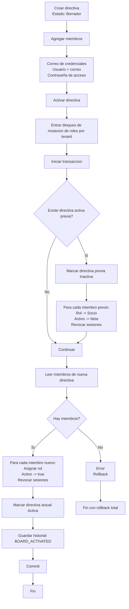

# Flujo Transaccional de Directivas

Este flujo implementa activacion segura de directivas con control de consistencia, bloqueo de mutaciones de rol y envio de credenciales al asignar miembros a la directiva.

## Resumen funcional

1. Se crea directiva en estado Borrador.
2. Se agregan miembros a la directiva y en ese momento se generan credenciales de acceso.
3. Se envía correo con usuario y contraseña al miembro agregado.
4. En activacion:
   - Se abre ventana de bloqueo de mutaciones de rol por tenant.
   - Se ejecuta transaccion atomica de cambio de directiva.
   - Se desactiva directiva anterior y sus miembros pasan a rol Socio + acceso inactivo.
   - Se aplican roles de la nueva directiva y acceso activo.
   - Se confirma transaccion.
5. La activacion no regenera credenciales; las credenciales ya fueron emitidas al momento de asignar cada miembro.

## Diagrama Mermaid

## Checklist rapido de validacion

1. Crear socio con correo nuevo: debe devolver 200 y no enviar credenciales.
2. Crear socio con correo repetido: debe devolver 409, no 500.
3. Agregar miembro a directiva: debe devolver 200 y enviar credenciales de acceso.
4. Activar directiva: debe devolver 200 sin regenerar credenciales.
5. Revisar logs: ya no debe aparecer `DateOnly cannot be used as a parameter value`.
6. Cargar listado de directivas: debe devolver 200 (ya no `Invalid cast from DateTime to DateOnly`).
