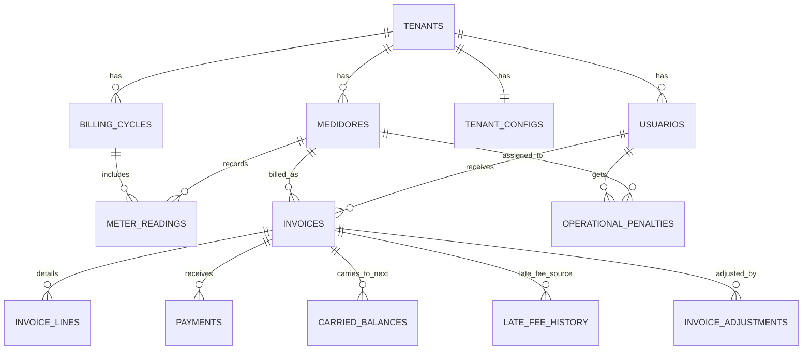

# Modulo de Facturacion Recurrente Orientado a Medidor

## 1. Principio rector

La unidad contable y de facturacion es el medidor (`medidores.id`), no el usuario.

Consecuencia directa:
- Un usuario con 3 medidores tiene 3 ciclos de lectura, 3 facturas y 3 saldos independientes.
- La agregacion por usuario es solo una vista de consulta, nunca una fusion de ledger.

## 2. Modelo SQL PostgreSQL normalizado (multi-tenant)

```sql
-- ==========================================================
-- Billing cycle catalog (soporta mensual hoy y quincenal futuro)
-- ==========================================================
CREATE TABLE IF NOT EXISTS billing_cycles (
    id UUID PRIMARY KEY DEFAULT gen_random_uuid(),
    tenant_id UUID NOT NULL REFERENCES tenants(id) ON DELETE CASCADE,
    period_code VARCHAR(20) NOT NULL,           -- ej: 2026-02 o 2026-Q1-H1
    period_start DATE NOT NULL,
    period_end DATE NOT NULL,
    due_date DATE NOT NULL,
    issue_date DATE NOT NULL,
    frequency VARCHAR(20) NOT NULL DEFAULT 'monthly', -- monthly | biweekly | custom
    status VARCHAR(20) NOT NULL DEFAULT 'open',       -- open | closed | invoiced
    created_at TIMESTAMP NOT NULL DEFAULT NOW(),
    closed_at TIMESTAMP,
    CONSTRAINT ck_billing_cycles_period CHECK (period_end >= period_start),
    CONSTRAINT ck_billing_cycles_status CHECK (status IN ('open', 'closed', 'invoiced')),
    UNIQUE (tenant_id, period_code)
);

CREATE INDEX IF NOT EXISTS idx_billing_cycles_tenant_dates
    ON billing_cycles(tenant_id, period_start, period_end);


-- ==========================================================
-- Meter readings (una lectura por medidor por ciclo)
-- ==========================================================
CREATE TABLE IF NOT EXISTS meter_readings (
    id UUID PRIMARY KEY DEFAULT gen_random_uuid(),
    tenant_id UUID NOT NULL REFERENCES tenants(id) ON DELETE CASCADE,
    meter_id UUID NOT NULL REFERENCES medidores(id) ON DELETE RESTRICT,
    billing_cycle_id UUID NOT NULL REFERENCES billing_cycles(id) ON DELETE RESTRICT,
    read_at DATE NOT NULL,
    previous_reading NUMERIC(12,3) NOT NULL,
    current_reading NUMERIC(12,3) NOT NULL,
    consumption_m3 NUMERIC(12,3) NOT NULL,
    source VARCHAR(20) NOT NULL DEFAULT 'manual', -- manual | import | mobile
    notes TEXT,
    created_by UUID REFERENCES usuarios(id) ON DELETE SET NULL,
    created_at TIMESTAMP NOT NULL DEFAULT NOW(),
    updated_at TIMESTAMP,
    CONSTRAINT ck_meter_readings_non_negative CHECK (
        previous_reading >= 0 AND current_reading >= 0 AND consumption_m3 >= 0
    ),
    CONSTRAINT ck_meter_readings_monotonic CHECK (current_reading >= previous_reading),
    CONSTRAINT ck_meter_readings_consumption CHECK (
        consumption_m3 = ROUND(current_reading - previous_reading, 3)
    ),
    UNIQUE (tenant_id, meter_id, billing_cycle_id)
);

CREATE INDEX IF NOT EXISTS idx_meter_readings_meter_cycle
    ON meter_readings(tenant_id, meter_id, billing_cycle_id);

CREATE INDEX IF NOT EXISTS idx_meter_readings_cycle
    ON meter_readings(tenant_id, billing_cycle_id);


-- ==========================================================
-- Invoices (documento cabecera por medidor y ciclo)
-- ==========================================================
CREATE TABLE IF NOT EXISTS invoices (
    id UUID PRIMARY KEY DEFAULT gen_random_uuid(),
    tenant_id UUID NOT NULL REFERENCES tenants(id) ON DELETE CASCADE,
    meter_id UUID NOT NULL REFERENCES medidores(id) ON DELETE RESTRICT,
    usuario_id UUID NOT NULL REFERENCES usuarios(id) ON DELETE RESTRICT,
    billing_cycle_id UUID NOT NULL REFERENCES billing_cycles(id) ON DELETE RESTRICT,
    meter_reading_id UUID NOT NULL REFERENCES meter_readings(id) ON DELETE RESTRICT,
    invoice_number VARCHAR(40) NOT NULL,
    status VARCHAR(30) NOT NULL DEFAULT 'borrador',
    currency VARCHAR(10) NOT NULL DEFAULT 'USD',
    subtotal NUMERIC(12,2) NOT NULL DEFAULT 0,
    previous_balance NUMERIC(12,2) NOT NULL DEFAULT 0,
    late_fee_amount NUMERIC(12,2) NOT NULL DEFAULT 0,
    operational_penalty_amount NUMERIC(12,2) NOT NULL DEFAULT 0,
    adjustments_amount NUMERIC(12,2) NOT NULL DEFAULT 0,
    total_amount NUMERIC(12,2) NOT NULL DEFAULT 0,
    paid_amount NUMERIC(12,2) NOT NULL DEFAULT 0,
    pending_amount NUMERIC(12,2) NOT NULL DEFAULT 0,
    issued_at TIMESTAMP,
    due_date DATE NOT NULL,
    paid_at TIMESTAMP,
    cancelled_at TIMESTAMP,
    reliquidated_from_invoice_id UUID REFERENCES invoices(id) ON DELETE SET NULL,
    created_at TIMESTAMP NOT NULL DEFAULT NOW(),
    updated_at TIMESTAMP,
    CONSTRAINT ck_invoices_status CHECK (
        status IN ('borrador','emitido','pendiente','vencido','parcialmente_pagado','pagado','anulado','reliquidado')
    ),
    CONSTRAINT ck_invoices_amounts_non_negative CHECK (
        subtotal >= 0 AND previous_balance >= 0 AND late_fee_amount >= 0 AND
        operational_penalty_amount >= 0 AND total_amount >= 0 AND paid_amount >= 0 AND pending_amount >= 0
    ),
    CONSTRAINT ck_invoices_pending_amount CHECK (
        pending_amount = ROUND(total_amount - paid_amount, 2)
    ),
    UNIQUE (tenant_id, invoice_number)
);

-- una sola factura activa por medidor + ciclo
CREATE UNIQUE INDEX IF NOT EXISTS ux_invoices_meter_cycle_active
    ON invoices(tenant_id, meter_id, billing_cycle_id)
    WHERE status NOT IN ('anulado','reliquidado');

CREATE INDEX IF NOT EXISTS idx_invoices_meter_status_due
    ON invoices(tenant_id, meter_id, status, due_date);

CREATE INDEX IF NOT EXISTS idx_invoices_user_status_due
    ON invoices(tenant_id, usuario_id, status, due_date);

CREATE INDEX IF NOT EXISTS idx_invoices_overdue
    ON invoices(tenant_id, due_date)
    WHERE status IN ('emitido','pendiente','parcialmente_pagado','vencido');


-- ==========================================================
-- Invoice lines (detalle auditable de cargos)
-- ==========================================================
CREATE TABLE IF NOT EXISTS invoice_lines (
    id UUID PRIMARY KEY DEFAULT gen_random_uuid(),
    tenant_id UUID NOT NULL REFERENCES tenants(id) ON DELETE CASCADE,
    invoice_id UUID NOT NULL REFERENCES invoices(id) ON DELETE CASCADE,
    line_type VARCHAR(40) NOT NULL,
    description TEXT NOT NULL,
    quantity NUMERIC(12,3) NOT NULL DEFAULT 1,
    unit_price NUMERIC(12,4) NOT NULL DEFAULT 0,
    amount NUMERIC(12,2) NOT NULL,
    reference_table VARCHAR(60),
    reference_id UUID,
    metadata JSONB,
    created_at TIMESTAMP NOT NULL DEFAULT NOW(),
    CONSTRAINT ck_invoice_lines_type CHECK (
        line_type IN (
            'base_fixed','tier_charge','excess_m3_charge','previous_balance','late_fee',
            'operational_penalty','credit_adjustment','debit_adjustment','reliquidation_delta'
        )
    )
);

CREATE INDEX IF NOT EXISTS idx_invoice_lines_invoice
    ON invoice_lines(tenant_id, invoice_id);

CREATE INDEX IF NOT EXISTS idx_invoice_lines_ref
    ON invoice_lines(tenant_id, reference_table, reference_id);


-- ==========================================================
-- Carried balances (arrastre estricto por medidor)
-- ==========================================================
CREATE TABLE IF NOT EXISTS carried_balances (
    id UUID PRIMARY KEY DEFAULT gen_random_uuid(),
    tenant_id UUID NOT NULL REFERENCES tenants(id) ON DELETE CASCADE,
    meter_id UUID NOT NULL REFERENCES medidores(id) ON DELETE RESTRICT,
    source_invoice_id UUID NOT NULL REFERENCES invoices(id) ON DELETE RESTRICT,
    target_invoice_id UUID NOT NULL REFERENCES invoices(id) ON DELETE RESTRICT,
    amount NUMERIC(12,2) NOT NULL,
    created_at TIMESTAMP NOT NULL DEFAULT NOW(),
    CONSTRAINT ck_carried_balances_positive CHECK (amount >= 0),
    UNIQUE (tenant_id, source_invoice_id, target_invoice_id)
);

CREATE INDEX IF NOT EXISTS idx_carried_balances_meter
    ON carried_balances(tenant_id, meter_id, created_at DESC);


-- ==========================================================
-- Late fee history (mora, nunca duplicada por origen)
-- ==========================================================
CREATE TABLE IF NOT EXISTS late_fee_history (
    id UUID PRIMARY KEY DEFAULT gen_random_uuid(),
    tenant_id UUID NOT NULL REFERENCES tenants(id) ON DELETE CASCADE,
    meter_id UUID NOT NULL REFERENCES medidores(id) ON DELETE RESTRICT,
    source_invoice_id UUID NOT NULL REFERENCES invoices(id) ON DELETE RESTRICT,
    target_invoice_id UUID NOT NULL REFERENCES invoices(id) ON DELETE RESTRICT,
    amount NUMERIC(12,2) NOT NULL,
    generated_at TIMESTAMP NOT NULL DEFAULT NOW(),
    rule_snapshot JSONB,
    CONSTRAINT ck_late_fee_non_negative CHECK (amount >= 0),
    UNIQUE (tenant_id, source_invoice_id)
);

CREATE INDEX IF NOT EXISTS idx_late_fee_meter
    ON late_fee_history(tenant_id, meter_id, generated_at DESC);


-- ==========================================================
-- Operational penalties (nacen a nivel usuario, se asignan 1 sola vez)
-- ==========================================================
CREATE TABLE IF NOT EXISTS operational_penalties (
    id UUID PRIMARY KEY DEFAULT gen_random_uuid(),
    tenant_id UUID NOT NULL REFERENCES tenants(id) ON DELETE CASCADE,
    usuario_id UUID NOT NULL REFERENCES usuarios(id) ON DELETE RESTRICT,
    source_type VARCHAR(30) NOT NULL, -- reunion | jornada_laboral | manual
    source_date DATE NOT NULL,
    amount NUMERIC(12,2) NOT NULL,
    status VARCHAR(20) NOT NULL DEFAULT 'pendiente', -- pendiente | asignada | anulada
    assignment_strategy VARCHAR(30) NOT NULL DEFAULT 'primary_meter',
    assigned_meter_id UUID REFERENCES medidores(id) ON DELETE SET NULL,
    assigned_invoice_id UUID REFERENCES invoices(id) ON DELETE SET NULL,
    assigned_at TIMESTAMP,
    notes TEXT,
    created_by UUID REFERENCES usuarios(id) ON DELETE SET NULL,
    created_at TIMESTAMP NOT NULL DEFAULT NOW(),
    CONSTRAINT ck_operational_penalties_amount CHECK (amount >= 0),
    CONSTRAINT ck_operational_penalties_status CHECK (status IN ('pendiente','asignada','anulada')),
    UNIQUE (tenant_id, usuario_id, source_type, source_date)
);

CREATE INDEX IF NOT EXISTS idx_operational_penalties_pending
    ON operational_penalties(tenant_id, status, source_date)
    WHERE status = 'pendiente';

CREATE INDEX IF NOT EXISTS idx_operational_penalties_assigned_meter
    ON operational_penalties(tenant_id, assigned_meter_id, assigned_at DESC);


-- ==========================================================
-- Invoice adjustments (debitos/creditos/reliquidacion)
-- ==========================================================
CREATE TABLE IF NOT EXISTS invoice_adjustments (
    id UUID PRIMARY KEY DEFAULT gen_random_uuid(),
    tenant_id UUID NOT NULL REFERENCES tenants(id) ON DELETE CASCADE,
    meter_id UUID NOT NULL REFERENCES medidores(id) ON DELETE RESTRICT,
    invoice_id UUID REFERENCES invoices(id) ON DELETE SET NULL,
    adjustment_type VARCHAR(30) NOT NULL, -- debit_note | credit_note | reliquidation
    amount NUMERIC(12,2) NOT NULL,
    reason TEXT NOT NULL,
    source_reading_id UUID REFERENCES meter_readings(id) ON DELETE SET NULL,
    source_invoice_id UUID REFERENCES invoices(id) ON DELETE SET NULL,
    linked_invoice_id UUID REFERENCES invoices(id) ON DELETE SET NULL,
    effective_cycle_id UUID REFERENCES billing_cycles(id) ON DELETE SET NULL,
    status VARCHAR(20) NOT NULL DEFAULT 'aplicado', -- borrador | aplicado | anulado
    created_by UUID REFERENCES usuarios(id) ON DELETE SET NULL,
    created_at TIMESTAMP NOT NULL DEFAULT NOW(),
    CONSTRAINT ck_invoice_adjustments_amount_non_zero CHECK (amount <> 0),
    CONSTRAINT ck_invoice_adjustments_type CHECK (adjustment_type IN ('debit_note','credit_note','reliquidation')),
    CONSTRAINT ck_invoice_adjustments_status CHECK (status IN ('borrador','aplicado','anulado'))
);

CREATE INDEX IF NOT EXISTS idx_invoice_adjustments_meter
    ON invoice_adjustments(tenant_id, meter_id, created_at DESC);

CREATE INDEX IF NOT EXISTS idx_invoice_adjustments_invoice
    ON invoice_adjustments(tenant_id, invoice_id);


-- ==========================================================
-- Payments (aplican a factura puntual del medidor)
-- ==========================================================
CREATE TABLE IF NOT EXISTS payments (
    id UUID PRIMARY KEY DEFAULT gen_random_uuid(),
    tenant_id UUID NOT NULL REFERENCES tenants(id) ON DELETE CASCADE,
    invoice_id UUID NOT NULL REFERENCES invoices(id) ON DELETE RESTRICT,
    meter_id UUID NOT NULL REFERENCES medidores(id) ON DELETE RESTRICT,
    usuario_id UUID NOT NULL REFERENCES usuarios(id) ON DELETE RESTRICT,
    payment_date DATE NOT NULL,
    amount NUMERIC(12,2) NOT NULL,
    method VARCHAR(30) NOT NULL, -- efectivo | transferencia | POS | pasarela
    reference VARCHAR(120),
    status VARCHAR(20) NOT NULL DEFAULT 'aprobado', -- pendiente_confirmacion | aprobado | rechazado | reversado
    notes TEXT,
    created_by UUID REFERENCES usuarios(id) ON DELETE SET NULL,
    created_at TIMESTAMP NOT NULL DEFAULT NOW(),
    CONSTRAINT ck_payments_positive CHECK (amount > 0),
    CONSTRAINT ck_payments_status CHECK (status IN ('pendiente_confirmacion','aprobado','rechazado','reversado'))
);

CREATE INDEX IF NOT EXISTS idx_payments_invoice
    ON payments(tenant_id, invoice_id, payment_date DESC);

CREATE INDEX IF NOT EXISTS idx_payments_meter
    ON payments(tenant_id, meter_id, payment_date DESC);
```

## 3. Integracion con tablas existentes

Relaciones claves:
- `billing_cycles.tenant_id -> tenants.id`
- `meter_readings.meter_id -> medidores.id`
- `invoices.meter_id -> medidores.id`
- `invoices.usuario_id -> usuarios.id` (solo para consulta por socio)
- `invoices.billing_cycle_id -> billing_cycles.id`
- `invoices.meter_reading_id -> meter_readings.id`
- `payments.invoice_id -> invoices.id`
- `operational_penalties.usuario_id -> usuarios.id`
- `operational_penalties.assigned_meter_id -> medidores.id`
- `tenant_configs` aporta reglas de tarifas y multas (snapshot en factura)

## 4. Estados de factura recomendados

- `borrador`: creada, aun editable
- `emitido`: publicada
- `pendiente`: emitida sin pago
- `vencido`: paso due_date con saldo > 0
- `parcialmente_pagado`: pago parcial
- `pagado`: saldo = 0
- `anulado`: invalida por error operativo
- `reliquidado`: cerrada por reliquidacion con documento compensatorio

Regla: `pagado`, `anulado` y `reliquidado` deben ser inmutables salvo metadatos administrativos.

## 5. Flujo mensual profesional (ciclo vencido)

1. Apertura ciclo (ej. `2026-02`) con fechas de corte y vencimiento.
2. Fontanero registra lectura por medidor en `meter_readings`.
3. Validar monotonicidad (`current >= previous`) y unicidad por período.
4. Cerrar ciclo (`billing_cycles.status = closed`).
5. Generar factura por medidor:
   - calcular consumo desde lectura
   - evaluar `tenant_configs.tramos_consumo_json` dinamicamente
   - crear `invoice_lines` por tramos
   - incorporar `previous_balance` del mismo medidor
   - incorporar mora pendiente del mismo medidor (`late_fee_history`)
   - incorporar multas operativas asignadas
6. Emitir factura (`emitido`/`pendiente`).
7. Registrar pago (`payments`) aplicando politicas de sobregiro.
8. Recalcular `paid_amount` y `pending_amount`.
9. Si `pending_amount = 0` -> `pagado`; si no y vence -> `vencido`.
10. En ciclo siguiente, generar mora solo para facturas vencidas no pagadas del mismo medidor.

## 6. Constraints fuertes

- Una sola lectura por medidor por período: `UNIQUE(tenant_id, meter_id, billing_cycle_id)`.
- Una sola factura activa por medidor por período: índice parcial `ux_invoices_meter_cycle_active`.
- No duplicar mora por origen: `UNIQUE(tenant_id, source_invoice_id)` en `late_fee_history`.
- Facturas pagadas inmutables: trigger BEFORE UPDATE (rechazar cambios de montos/lineas si estado final).
- `current_reading >= previous_reading`: `ck_meter_readings_monotonic`.
- Pagos mayores al saldo: trigger de politica.

Trigger recomendado (resumen):
- bloquear `payments.amount > invoices.pending_amount` salvo `allow_overpayment=true` (feature flag tenant).
- bloquear update de `invoices` en estados finales.

## 7. Modelado de períodos

Recomendacion profesional:
- Usar tabla `billing_cycles` + `period_code`.
- Evitar depender solo de primer dia del mes como llave de negocio.

Ventajas:
- soporta mensual hoy, quincenal mañana y cortes personalizados sin romper modelo
- permite auditoria de cierres y reaperturas
- desacopla calendario de facturacion de fechas de lectura reales

## 8. Multas operativas (usuario -> medidor)

Estrategia principal recomendada: `primary_meter`.

Criterios para medidor principal:
- medidor activo mas antiguo del usuario, o
- medidor marcado como principal (si se agrega flag futuro)

Reglas:
- una multa operativa se asigna una sola vez (`status=asignada`)
- guardar `assigned_meter_id` y `assigned_invoice_id`
- nunca duplicar en varios medidores

Alternativa avanzada (futuro): `proportional_split` por consumo historico, pero complica auditoria.

## 9. Consultas sin romper independencia contable

Deuda total por usuario:
```sql
SELECT i.usuario_id, SUM(i.pending_amount) AS total_pending
FROM invoices i
WHERE i.tenant_id = @tenantId
  AND i.usuario_id = @usuarioId
  AND i.status IN ('emitido','pendiente','vencido','parcialmente_pagado')
GROUP BY i.usuario_id;
```

Deuda por medidor:
```sql
SELECT i.meter_id, SUM(i.pending_amount) AS pending_by_meter
FROM invoices i
WHERE i.tenant_id = @tenantId
  AND i.usuario_id = @usuarioId
  AND i.status IN ('emitido','pendiente','vencido','parcialmente_pagado')
GROUP BY i.meter_id;
```

Recibos vencidos por socio:
```sql
SELECT i.*
FROM invoices i
WHERE i.tenant_id = @tenantId
  AND i.usuario_id = @usuarioId
  AND i.status IN ('vencido','pendiente','parcialmente_pagado')
  AND i.due_date < CURRENT_DATE
ORDER BY i.due_date ASC;
```

## 10. Reliquidaciones (sin recalcular factura pagada)

Politica:
- Nunca reescribir una factura pagada.
- Generar ajuste compensatorio:
  - `debit_note` si faltaba cobrar
  - `credit_note` si se cobro de mas
- Opcional: factura de reliquidacion ligada por `reliquidated_from_invoice_id`.

Flujo:
1. Detectar inconsistencia de lectura.
2. Calcular delta contra documento original.
3. Registrar en `invoice_adjustments`.
4. Emitir documento compensatorio (linea `reliquidation_delta`).
5. Marcar original como `reliquidado` solo si aplica politica del negocio.

## 11. Servicios .NET (SRP + patrones)

- `BillingCycleService`: abre/cierra ciclos, valida ventanas de corte.
- `MeterReadingService`: CRUD de lecturas, monotonicidad, idempotencia por ciclo.
- `InvoiceGenerationService`: orquesta factura por medidor, arma lineas, snapshot de reglas.
- `LateFeeService`: detecta vencidos y genera mora no duplicada.
- `PenaltyAssignmentService`: asigna multas operativas pendientes a medidor objetivo.
- `PaymentService`: registra pagos, valida politica de sobrepago, transiciones de estado.
- `ReconciliationService`: reliquidaciones, notas de debito/credito, conciliacion.

Patrones sugeridos:
- Strategy para calculo de tarifa por `tramos_consumo_json`.
- Domain Service para reglas transversales (mora, asignacion multas).
- Outbox para eventos de emision y cobranza (escalabilidad).
- Unit of Work para transacciones atomicas.

## 12. Endpoints REST sugeridos

- `POST /meter-readings`
- `POST /billing-cycles/{period}/generate`
- `POST /invoices/{id}/pay`
- `POST /invoices/{id}/reliquidate`
- `GET /meters/{id}/invoice-history`
- `GET /users/{id}/debt-summary`

Extras recomendados:
- `POST /billing-cycles` (apertura)
- `POST /billing-cycles/{id}/close`
- `GET /billing-cycles/{period}/status`

## 13. Diagrama Mermaid



## 14. Casos borde y prevencion de inconsistencias

Casos borde:
- doble carga de lectura del mismo medidor/período
- lectura menor a anterior por error de captura
- factura pagada que se intenta modificar
- mora duplicada por reintento de job
- multas operativas repetidas para mismo evento
- pago concurrente doble en caja

Prevencion:
- unique constraints + indices parciales
- transacciones serializables en cierre/generacion
- idempotency keys para endpoints de generacion/pago
- triggers de inmutabilidad
- versionado optimista (`updated_at` + `etag`) para UI

## 15. Escalabilidad para millones de lecturas

Recomendaciones:
- particion por rango mensual en `meter_readings` e `invoices` (por `tenant_id + period_start` o fecha)
- índices compuestos enfocados en consultas reales (meter-period, overdue, pending)
- jobs batch por tenant/ciclo con colas (Hangfire/Quartz + workers)
- snapshots de tarifa en factura para evitar recalculo historico
- archivado de históricos fríos (read replica / data warehouse)

## 16. SOLID aplicado

- SRP: cada servicio con una sola razon de cambio.
- OCP: nuevas reglas de tarifa con estrategias sin tocar orquestador.
- LSP: implementaciones de `ITariffCalculator` intercambiables.
- ISP: interfaces separadas para lectura, facturacion, cobro, reliquidacion.
- DIP: servicios dependen de abstracciones (repositorios, calculadoras, politicas).

Resultado: modelo auditable, multi-tenant, escalable y alineado al principio de independencia contable por medidor.
