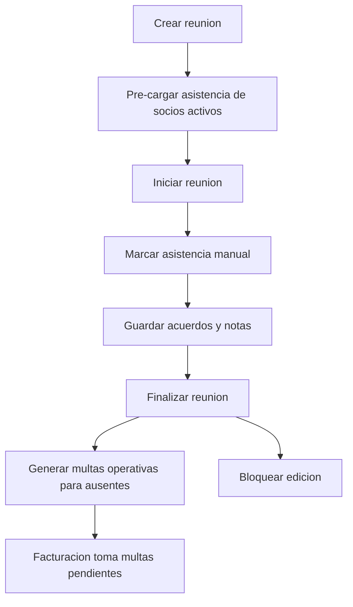

# Modulo Reuniones

## Objetivo

Gestionar convocatorias, asistencia manual de socios, acuerdos de secretaria y multas operativas por inasistencia.

Controller:

- `ReunionesController`

Ruta base:

- `/api/reuniones`

## Alcance funcional

- Crear reuniones con titulo, fecha, hora de inicio y puntos a tratar.
- Pre-generar asistencia para todos los socios activos del tenant.
- Iniciar una reunion cuando ya va a comenzar.
- Marcar asistencia manualmente por socio.
- Guardar acuerdos y notas de secretaria.
- Finalizar la reunion y generar multas operativas para los ausentes.
- Mantener historial de cambios y eventos.
- Bloquear edicion cuando el estado sea `Finalizada`.

## Endpoints

- `GET /api/reuniones`
- `GET /api/reuniones/{id}`
- `POST /api/reuniones`
- `PUT /api/reuniones/{id}`
- `POST /api/reuniones/{id}/start`
- `PUT /api/reuniones/{id}/attendance`
- `PUT /api/reuniones/{id}/acuerdos`
- `POST /api/reuniones/{id}/finalize`

## Reglas clave

- Solo usuarios con rol de administracion o directiva pueden operar el modulo.
- La asistencia se construye sobre los socios activos del tenant al crear la reunion.
- Si la reunion ya fue finalizada, no se permiten ediciones posteriores.
- Al finalizar, cada ausente genera una multa operativa pendiente con `source_type = 'reunion'`.
- Los acuerdos se almacenan como lista ordenada para conservar la secuencia de la sesion.
- El historial queda atado a la reunion y conserva trazabilidad de cambios y cierres.

## Tablas agregadas

- `reuniones`
- `reunion_asistencias`
- `reunion_historial`

## Diagrama Mermaid



## Ejemplo rapido

```http
POST /api/reuniones
Authorization: Bearer <token-cookie>
```