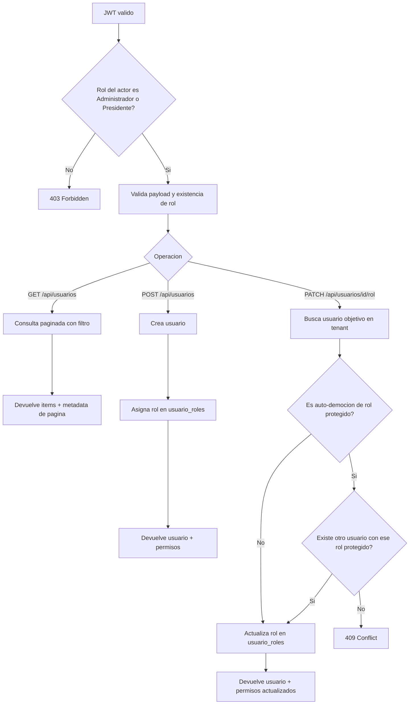

# Modulo Usuarios, Roles y Permisos

## Objetivo

Este modulo agrega gestion de usuarios basada en roles y permisos normalizados.

Tambien incluye:

- tabla `docs` para documentos (como DUI),
- tabla `directiva` para periodos de junta directiva,
- tabla `directiva_miembros` para asignar usuarios y cargos dentro de un periodo.

Controller asociado:

- `UsuariosController`

Ruta base:

- `/api/usuarios`

URL local de prueba:

- `http://localhost:5177`
- `https://localhost:7227`

## Esquema de base de datos agregado

Tablas nuevas:

- `roles`
- `permisos`
- `rol_permisos`
- `usuario_roles`
- `docs`
- `directiva`
- `directiva_miembros`

Reglas clave:

- `Administrador` tiene todos los permisos.
- `Socio` queda en modo lectura para historial (pagos y multas).
- La asignacion actual del rol del usuario vive en `usuario_roles` (`activo = true`).
- `usuarios.rol` se conserva como espejo de compatibilidad para no romper flujos existentes.

## Endpoints del modulo

- `GET /api/usuarios`
- `POST /api/usuarios`
- `PATCH /api/usuarios/{usuarioId}/rol`

Ambos requieren JWT (`Authorization: Bearer <token>`).

## 0. Listar usuarios con paginacion y filtro

Ruta:

```http
GET /api/usuarios?page=1&pageSize=20&search=jeffrey
Authorization: Bearer <token>
```

Query params:

- `page`: pagina actual (por defecto `1`).
- `pageSize`: cantidad por pagina (por defecto `20`, maximo `100`).
- `search`: filtro opcional por nombre/apellido o DUI.

Notas del filtro:

- Si escribo nombre, busca coincidencias parciales (`jeffrey`, `mardoqueo`, etc.).
- Si escribo DUI en el mismo input, puede ir con o sin guiones, porque se normaliza a digitos.

Respuesta esperada `200 OK`:

```json
{
  "items": [
    {
      "id": "aaaaaaaa-1111-2222-3333-bbbbbbbbbbbb",
      "tenantId": "22222222-2222-2222-2222-222222222222",
      "nombre": "Jeffrey",
      "apellido": "Mardoqueo",
      "dui": "01234567-8",
      "correo": "jeffrey@losrobles.com",
      "telefono": "7000-3333",
      "rol": "Socio",
      "fechaCreacion": "2026-04-01T19:00:00Z"
    }
  ],
  "page": 1,
  "pageSize": 20,
  "total": 86,
  "totalPages": 5,
  "hasNext": true,
  "hasPrevious": false
}
```

Errores esperados:

- `401 Unauthorized` si el token no es valido.
- `403 Forbidden` si el rol autenticado no puede gestionar usuarios.

## Regla critica de negocio

Un usuario no puede quitarse a si mismo un rol protegido (`Administrador` o `Presidente`) si no existe otro usuario con ese mismo rol en su tenant.

## 1. Crear usuario

Ruta:

```http
POST /api/usuarios
Authorization: Bearer <token>
Content-Type: application/json
```

Body de ejemplo:

```json
{
  "nombre": "Ana",
  "apellido": "Lopez",
  "dui": "98765432-1",
  "correo": "ana.lopez@losrobles.com",
  "telefono": "7000-2222",
  "direccion": "Residencial Los Robles",
  "password": "AnaSegura123",
  "rol": "Socio"
}
```

Respuesta esperada `200 OK`:

```json
{
  "id": "aaaaaaaa-1111-2222-3333-bbbbbbbbbbbb",
  "tenantId": "22222222-2222-2222-2222-222222222222",
  "nombre": "Ana",
  "apellido": "Lopez",
  "correo": "ana.lopez@losrobles.com",
  "telefono": "7000-2222",
  "direccion": "Residencial Los Robles",
  "rol": "Socio",
  "permisos": [
    "multas.read",
    "pagos.read"
  ],
  "fechaCreacion": "2026-04-01T19:00:00Z"
}
```

Errores esperados:

- `401 Unauthorized` si el token no es valido.
- `403 Forbidden` si el rol autenticado no puede gestionar usuarios.
- `409 Conflict` si ya existe correo o el rol enviado no existe.

## 2. Actualizar rol de usuario (PATCH parcial)

Ruta:

```http
PATCH /api/usuarios/{usuarioId}/rol
Authorization: Bearer <token>
Content-Type: application/json
```

Body de ejemplo:

```json
{
  "rol": "Tesorero"
}
```

Respuesta esperada `200 OK`:

```json
{
  "id": "aaaaaaaa-1111-2222-3333-bbbbbbbbbbbb",
  "tenantId": "22222222-2222-2222-2222-222222222222",
  "nombre": "Ana",
  "apellido": "Lopez",
  "correo": "ana.lopez@losrobles.com",
  "telefono": "7000-2222",
  "direccion": "Residencial Los Robles",
  "rol": "Tesorero",
  "permisos": [
    "config.read",
    "docs.manage",
    "multas.read",
    "pagos.read",
    "usuarios.read"
  ],
  "fechaCreacion": "2026-04-01T19:00:00Z"
}
```

Errores esperados:

- `404 NotFound` si el usuario no existe en el tenant autenticado.
- `409 Conflict` si el rol no existe o se viola la regla de auto-democion.
- `403 Forbidden` si el usuario autenticado no tiene permisos para administrar usuarios.

## Flujo recomendado de pruebas

1. Ejecutar `POST /api/auth/login` para obtener token.
2. Probar `GET /api/usuarios?page=1&pageSize=20` y confirmar paginacion.
3. Probar `GET /api/usuarios?search=jeffrey` por nombre.
4. Probar `GET /api/usuarios?search=012345678` por DUI sin guion.
5. Probar `POST /api/usuarios` con rol `Socio`.
6. Tomar el `id` del usuario creado.
7. Probar `PATCH /api/usuarios/{usuarioId}/rol` para cambiar a `Tesorero`.
8. Probar auto-democion del mismo `Administrador` cuando es el unico: debe responder `409`.

## Ejemplo rapido en cURL

```bash
curl -X POST "http://localhost:5177/api/usuarios" \
  -H "Authorization: Bearer TOKEN_JWT" \
  -H "Content-Type: application/json" \
  -d "{\"nombre\":\"Ana\",\"apellido\":\"Lopez\",\"dui\":\"98765432-1\",\"correo\":\"ana.lopez@losrobles.com\",\"telefono\":\"7000-2222\",\"direccion\":\"Residencial Los Robles\",\"password\":\"AnaSegura123\",\"rol\":\"Socio\"}"
```

## Diagrama de flujo (Mermaid)


